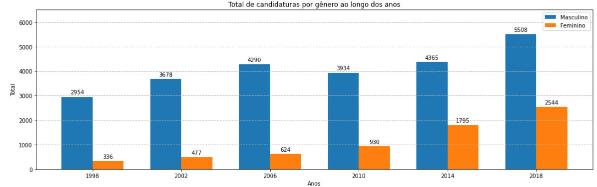

# basedosdados-elections-analysis
This jupyter notebook was made to analyze the data from Brazilian elections congressperson, the data is coming from [Base dos Dados](https://basedosdados.org/).

### Welcome! Here is some of the information and subject available in the analysis:
> - Data access;
> - EDA (Exploratory data analysis);
> - Data formating;
> - Data visualization
> - Insights
> - References

### To start playing with this analysis, there are two things you need to do:

1. Create your access to the Base dos Dados:
	- https://basedosdados.github.io/mais/#acessando-tabelas-tratadas-bd

2. If you want to proceed with the traditional way, here is the steps to get everything installed:
    - Installing requirements -> check the **``requirements folder``** to install all dependencies;
    - Explore the jupyter notebook inside **``src folder``** -> *brazilian-election-basedosdados-pt.ipynb*.
	
3. The analysis is available in PT-Portuguese and EN-English:
	- Portuguese version: ``src/brazilian-election-basedosdados-pt.ipynb``
	- English version: ``src/brazilian-election-basedosdados-en.ipynb``

### Here are some ideas to contribute if you want (and also my TO DO list for this project):
 - [*] **English** -> Translate analysis to English;
 - [ ] **Interactive app** -> Migrate analysis to a web app using Streamlit;
 - [ ] **Elaborate advanced visualization** -> Elaborate advanced visualization with a BI tool as Power BI, Tableau and similars.
